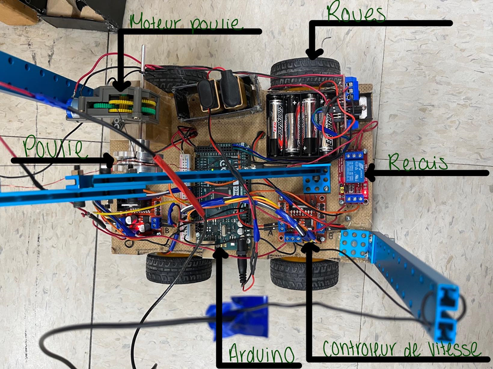

# Robocube
Le projet robocube est un projet fait en équipe dans le cadre du cours *Activité d'intégration 360-ASK-03* dans mon parcours collégial.

Membres qui ont participés à ce projet: Coraly Avoine, Jacob Perreault, [Luckas Rakotondrafara](https://github.com/LuckasRakoto) et [moi (Gabriel Landry)](https://github.com/Sportek).

Dans le cadre de ce cours, nos objectifs étaient les suivants: 
* Construire un robot qui soit capable de déterminer la position d'un bloc et de le récupérer à l'aide d'un électro-aimant.
  * Détecter un objet à l'aide de plusieurs capteurs à ultrasons,
  * Récupérer le bloc à l'aide d'un électro-aimant,
  * Retour au point initial.

Voici le robot en image: 

Vous retrouverez la vidéo finale du projet en cliquant [ici](https://youtube.com/shorts/AC5wFvs3WiA?feature=share).
